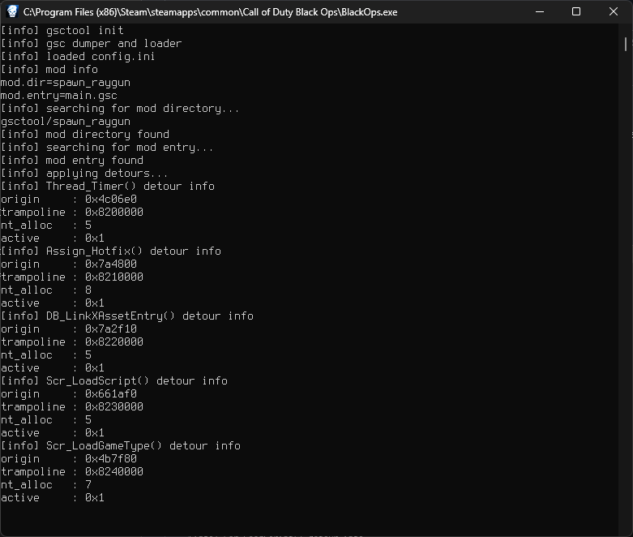

# gsctool

```
  ________________________  ____  __ 
 / ___/ __/ ___/_  __/ __ \/ __ \/ / 
/ (_ /\ \/ /__  / / / /_/ / /_/ / /__
\___/___/\___/ /_/  \____/\____/____/
                 
```

Simple `GSC` script loader and dumper for the `PC` version of `Call Of Duty: Black Ops 1 (T5)`.

[`https://journal.lunar.sh/2023/gsctool.html`](https://journal.lunar.sh/2023/gsctool.html)

To load the demo `GSC` plugin, copy `gsctool` to the game's root directory.

This demo will give you a `raygun` on spawn in `SP` zombie mode. 

* `GSC` dumps are written to `gsctool/cache`.

> Note: This project is intended to be a starting point for more advanced `GSC` modding.

# Instructions

Run: `git submodule update --init --recursive` to clone submodules.

Then build project using the provided `makefile` in `WSL` (`Windows`)
and inject resulting `DLL`.

The compiler used for this project is [`tcc`](https://github.com/lunarjournal/tcc) (`Tiny C Compiler`).

> Note: You can modify and hot-reload `GSC` scripts while `Black Ops` is running by quiting
the level and starting it again.




Files:
<br/>
* `gsctool.h` - `GSC` loader definitions.
* `gsctool.c` - `core` implementation.
* `offsets.h` - `T5` function `offsets`.

# Dependencies

* [`cdl86`](https://github.com/lunar-rf/cdl86) - `x86_64` detours library.
* [`miniz`](https://github.com/lunar-rf/miniz) - `zlib` library.

# Signature

```
+---------------------------------------+
|     .-.       .-.       .-.           |
|    /   \     /   \     /   \     +    |
|         \   /     \   /     \   /     |
|          "_"       "_"       "_"      |
|                                       |
|  _   _   _ _  _   _   ___   ___ _  _  |
| | | | | | | \| | /_\ | _ \ / __| || | |
| | |_| |_| | .` |/ _ \|   /_\__ \ __ | |
| |____\___/|_|\_/_/ \_\_|_(_)___/_||_| |
|                                       |
|                                       |
| Lunar RF Labs                         |
| https://lunar.sh                      |
|                                       |
| Research Laboratories                 |
| Copyright (C) 2022-2024               |
|                                       |
+---------------------------------------+
```

